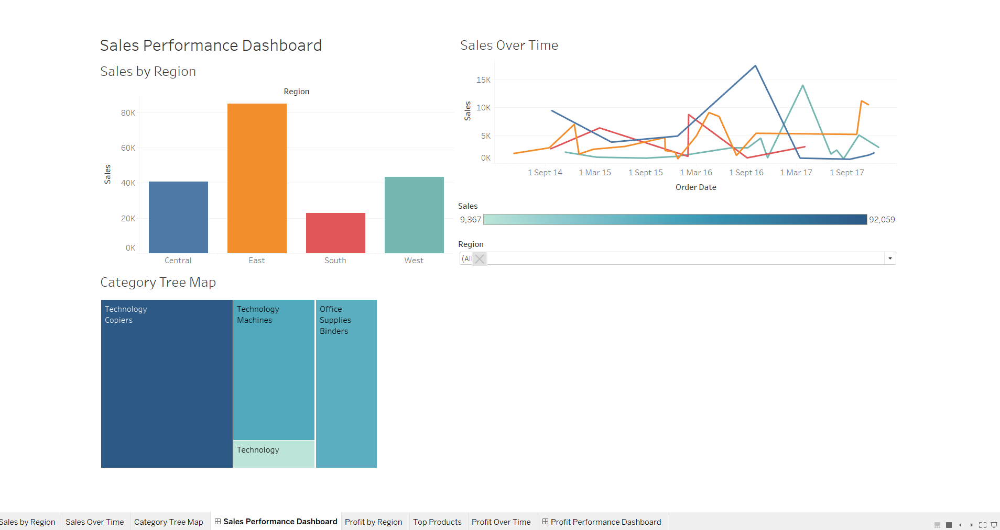

# 📊 Sales & Profit Performance Dashboard (Tableau)

This project contains two Tableau dashboards designed for data-driven business insights:

## 📌 Dashboards Included
1. **Sales Performance Dashboard**
   - Monthly sales trend
   - Sales by category & sub-category
   - Regional sales comparison
   - Filter by region

2. **Profit Performance Dashboard**
   - Profit by region
   - Top products by profit
   - Profit trend over time
   - Filters: Region, Product Name

## 💾 File Included
- `Sales_Profit_Dashboard.twb` → Tableau workbook file with all dashboards

## 📈 Tools Used
- Tableau Desktop
- Sample Superstore dataset

## 📷 Dashboard Screenshot:

---

✅ Built as a beginner-friendly data analysis project using interactive visualizations.
